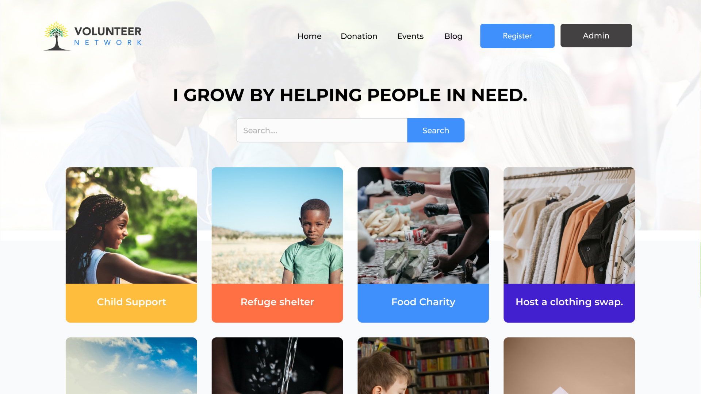

# 🚀 [ Volunteer Network: application for charity works](https://ims-volnet.web.app/)

### Features -

-   Modern responsive home page to showcase available charity works.
-   User can register for volunteer works
-   Admin can add new task and manage registered users.

### Technologies -

-   ReactJS
-   Bootstrap
-   React Router
-   Context API
-   NodeJS
-   ExpressJS
-   MongoDB
-   Firebase Authentication
-   Heroku

[live demo](https://ims-volnet.web.app/) | [github repository (client)](https://github.com/iamsaief/volunteer-network-client) | [github repository (server)](https://github.com/iamsaief/volunteer-network-server)
